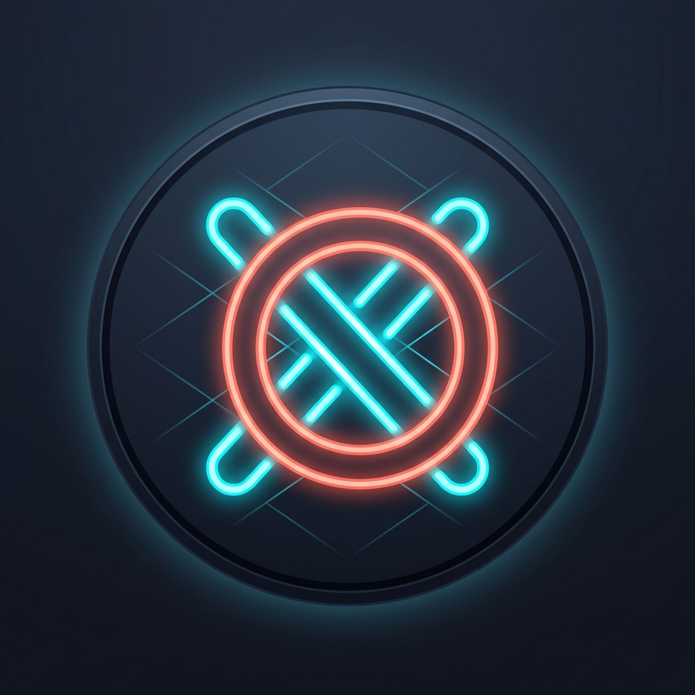

# Tres en Raya Mobile | React Native & Expo

<p align="center">
  
</p>

<p align="center">
  <strong>El clásico llevado a nuevas dimensiones.</strong><br />
  Port móvil completo y de alta fidelidad basado en el proyecto original en <strong>C++17 y SFML</strong>.
</p>

---

## 📱 Descripción General

**Tres en Raya Mobile** es una adaptación moderna desarrollada desde cero para dispositivos táctiles (Android e iOS) utilizando **React Native**, **Expo SDK 52**, **TypeScript**, **Zustand**, **React Native Reanimated** y **React Navigation**.

A diferencia de las implementaciones escolares o simplificadas de Tic-Tac-Toe, este proyecto conserva el 100% de las modalidades hiperdimensionales, los algoritmos de Inteligencia Artificial (Minimax, Alpha-Beta, heurísticas de evaluación), el análisis de partidas didáctico (*Game Review*), el cálculo de precisión táctica (%) y la paleta estética futurista (*Dark Slate*, *Neon Cyan*, *Coral* y *Gold*).

---

## 🚀 Características Principales

### 1. Cinco Modalidades de Tablero con Reglas Formales

1. **3x3 Clásico (2D Tradicional)**:
   - Cuadrícula de 9 casillas con 3 en línea para la victoria.
   - **8 líneas ganadoras** (3 filas, 3 columnas, 2 diagonales).
   - IA Minimax con árbol de juego completo e imbatible en dificultad difícil.
2. **3x3x3 en 3D / Qubic**:
   - 27 casillas distribuidas en 3 pisos isométricos (`PISO 1`, `PISO 2`, `PISO 3`).
   - **Exactamente 49 líneas ganadoras** en el espacio tridimensional (27 axiales 1D, 18 diagonales de plano 2D y 4 diagonales espaciales 3D que cruzan el centro `(1,1,1)`).
   - Selector táctil de pisos con indicador de coordenadas $(X, Y, Z)$ y alertas visuales si existen amenazas en otros pisos.
3. **3x3x3x3 en 4D (Teseracto / Hipercubo)**:
   - **81 casillas** distribuidas en una Macro-Matriz de 3 Universos $W$ $\times$ 3 Pisos $Z$.
   - **Exactamente 272 líneas ganadoras** en el hiperespacio (108 axiales 1D, 108 diagonales planares 2D, 48 diagonales espaciales 3D y 8 hiperdiagonales que cruzan el hipercentro `(1,1,1,1)`).
   - Telemetría en tiempo real: muestra las coordenadas $(X, Y, Z, W)$ y el conteo dinámico de líneas ganadoras que cruzan por la casilla activa.
   - Detección y trazado de victorias hiperdimensionales que atraviesan diferentes universos.
4. **4x4 Libre**:
   - Tablero extendido de 16 casillas con colocación libre.
   - 4 fichas consecutivas para la victoria.
   - **10 líneas ganadoras** (4 filas, 4 columnas, 2 diagonales mayores).
   - IA con evaluación de amenazas abiertas y control territorial del cuadrante central `(1,1)`, `(1,2)`, `(2,1)`, `(2,2)`.
5. **4x4 con Gravedad (Estilo Conecta 4)**:
   - Física de caída por columnas hacia la fila inferior desocupada.
   - Animación fluida de caída elástica con rebote (*ease-out bounce*) a 60 FPS con React Native Reanimated.
   - Previsualización traslúcida (*ghost landing*) del lugar exacto donde caerá la ficha.
   - IA Minimax a profundidad 6 con ordenación óptima de columnas `[1, 2, 0, 3]`, filtro de columnas suicidas y evaluación vertical/horizontal.

---

### 2. Modos de Juego Versátiles
- **Jugador vs Computadora (PvCPU)**: Juega contra la IA pudiendo elegir jugar de 1º con X, 2º con O (la CPU inicia la partida) o turno aleatorio. Incluye simulación de pensamiento no bloqueante (~450 ms).
- **Jugador vs Jugador (PvP Local)**: Dos personas alternando turnos en el mismo teléfono móvil.
- **Computadora vs Computadora (CPU vs CPU / Espectador)**: Partida automatizada entre dos inteligencias artificiales con pausas fluidas y variabilidad entre movimientos equivalentes.

---

### 3. Sistema de Análisis de Partidas (Game Review)
Al concluir cualquier partida, puedes acceder a la herramienta interactiva de análisis jugada a jugada:
- **Navegación Táctil**: Botones `|< Inicio`, `< Anterior`, `Siguiente >` y `Fin >|` para reproducir el tablero en cualquier momento de la partida.
- **Clasificación Didáctica de Jugadas**:
  - 🎯 **Mejor jugada** (100% precisión): Jugada ganadora, bloqueo de amenaza inminente o coincidente con el movimiento óptimo de Minimax.
  - 👍 **Buena jugada** (80% precisión): Mantiene la posición equilibrada y segura.
  - ⚠️ **Imprecisión** (50% precisión): Movimiento seguro pero subóptimo.
  - ❌ **Error táctico** (25% precisión): Casilla que permite al rival responder con victoria en el siguiente turno.
  - 💀 **Pifia grave** (0% precisión): Omisión de una victoria servida o falta de bloqueo a una amenaza directa del oponente.
- **Sugerencia Visual de la IA**: Resaltado translúcido con contorno verde esmeralda (`#00E676`) indicando exactamente la mejor casilla recomendada y sus coordenadas.
- **Cálculo de Precisión Global (%)**: Porcentaje táctico ponderado para el Jugador X y el Jugador O con barra de progreso.

---

### 4. Audio, Hápticos y Persistencia
- **Audio Procedimental**: Sintetizador de ondas sinusoidales en memoria (tonos de 680 Hz para X, 520 Hz para O, 900 Hz para click, y arpegios armónicos para victoria y empate) que no requiere archivos de audio externos.
- **Feedback Háptico**: Integración con `expo-haptics` para respuestas físicas sutiles en pulsaciones, colocación de fichas, advertencias y victorias.
- **Marcador Persistente**: Historial de partidas jugadas, victorias, derrotas, empates, porcentajes y precisión promedio guardados mediante `AsyncStorage`.

---

## 🛠️ Requisitos Previos

- **Node.js**: v18 o superior (recomendado v20+ o v22+).
- **npm**: v9+ o v10+.
- **Expo Go**: Aplicación móvil instalada en tu teléfono Android o iOS (disponible en Google Play Store y Apple App Store) para pruebas en tiempo real.

---

## 📦 Instalación y Ejecución

1. **Clonar o situarse en el directorio del proyecto móvil**:
   ```bash
   cd c:\Trabajo\C++\TresEnRayaMobile\tres-en-raya-mobile
   ```

2. **Instalar dependencias**:
   ```bash
   npm install
   ```

3. **Iniciar el servidor de desarrollo Expo**:
   ```bash
   npx expo start
   ```

4. **Abrir en Android**:
   - Presiona `a` en la terminal para abrir en el emulador de Android (si está instalado).
   - O abre la app **Expo Go** en tu dispositivo Android físico y escanea el código QR mostrado en la terminal.

5. **Abrir en iOS**:
   - Presiona `i` en la terminal para abrir en el simulador de iOS (en macOS).
   - O escanea el código QR con la cámara de tu iPhone para abrirlo en Expo Go.

6. **Abrir en Web**:
   - Presiona `w` en la terminal para ejecutarlo en tu navegador.

---

## 🧪 Ejecución de Tests Unitarios

El proyecto cuenta con una suite completa de pruebas unitarias en **Jest** que valida formalmente:
- Generación matemática de las 8, 10, 49 (3D) y 272 (4D) líneas ganadoras.
- Lógica de estados del tablero, detección de victorias y física de gravedad.
- Inteligencia artificial en dificultades Fácil, Medio y Difícil (portado de `test_difficulties.cpp`).
- Clasificación de jugadas y cálculo de precisión en Game Review.

Para ejecutar los tests:
```bash
npm test
```

Para verificar tipos de TypeScript:
```bash
npm run typecheck
```

---

## 📁 Estructura del Proyecto

```text
tres-en-raya-mobile/
├── App.tsx                     # Providers, NavigationContainer y Tema oscuro
├── app.json                    # Configuración de Expo, orientación portrait e icono
├── index.js                    # Punto de entrada con registerRootComponent
├── package.json                # Dependencias (Expo SDK 52, React Native 0.76, Zustand, etc.)
├── tsconfig.json               # Configuración TypeScript estricta con alias @/*
├── jest.config.js              # Configuración de Jest con ts-jest
├── MIGRATION_PLAN.md           # Documento exhaustivo del plan de migración técnica
├── assets/                     # Iconos y splash en alta resolución
│   ├── icon.png
│   └── splash.png
├── src/
│   ├── constants/
│   │   ├── colors.ts           # Paleta oficial Dark Slate, Neon Cyan, Coral, etc.
│   │   └── timing.ts           # Tiempos de animación y retardo CPU (~450ms)
│   ├── types/
│   │   ├── board.ts            # BoardType, Vector4i, CellSymbol, Grids 2D/3D/4D
│   │   ├── game.ts             # GameMode, PlayerTurnOrder, Score, OverallStats
│   │   ├── ai.ts               # Difficulty, BestMoveResult
│   │   ├── player.ts           # Player, PlayerType
│   │   └── review.ts           # MoveRecord, MoveAnalysis, MoveQuality, GameReviewReport
│   ├── game/
│   │   ├── board/
│   │   │   ├── WinningLines.ts # Generador exacto de 8, 10, 49 y 272 líneas ganadoras
│   │   │   └── BoardModel.ts   # Estado, movimientos, gravedad y chequeo de victoria
│   │   ├── ai/
│   │   │   ├── Minimax3x3.ts   # Minimax imbatible para 3x3 clásico
│   │   │   ├── Minimax4x4.ts   # Minimax depth 3 con control de centro para 4x4
│   │   │   ├── MinimaxGravity.ts # Minimax depth 6 con orden [1,2,0,3] para gravedad
│   │   │   ├── Minimax3D.ts    # Minimax depth 2 con control de centro (1,1,1) para 3D
│   │   │   ├── Minimax4D.ts    # Minimax depth 1 con 272 líneas y hipercentro para 4D
│   │   │   └── AIEngine.ts     # Fachada unificada con soporte asíncrono no bloqueante
│   │   └── review/
│   │       └── ReviewEngine.ts # Motor de análisis didáctico y precisión (%)
│   ├── stores/
│   │   ├── useGameStore.ts     # Partida activa, turnos, marcador y despacho de IA
│   │   ├── useSettingsStore.ts # Sonido, vibración, dificultades por modalidad
│   │   └── useStatsStore.ts    # Victorias, derrotas, empates persistentes con AsyncStorage
│   ├── services/
│   │   ├── AudioService.ts     # Sintetizador procedural en memoria y reproductor
│   │   ├── HapticService.ts    # Integración con expo-haptics
│   │   └── StorageService.ts   # Wrapper tipado sobre AsyncStorage
│   ├── components/
│   │   ├── common/
│   │   │   ├── GameButton.tsx  # Botón con efecto glow, hover y feedback háptico
│   │   │   ├── GameCard.tsx    # Tarjeta de superficie oscura elevada
│   │   │   ├── Badge.tsx       # Insignia de modalidad, dificultad o jugada
│   │   │   └── AccuracyBar.tsx # Barras de precisión porcentual para X y O
│   │   ├── board/
│   │   │   ├── Cell2D.tsx      # Casilla táctil con animación Reanimated de ficha
│   │   │   ├── Board2D.tsx     # Tablero para 3x3 y 4x4 libre
│   │   │   ├── BoardGravity.tsx# Tablero con guías de columna y animación de caída
│   │   │   ├── Board3D.tsx     # Visualizador 3D con selector de pisos Z e indicadores
│   │   │   └── Board4D.tsx     # Visualizador 4D con selector W y Z y telemetría
│   │   ├── game/
│   │   │   ├── ScoreBoard.tsx  # Marcador de victorias y empates
│   │   │   ├── TurnIndicator.tsx # Indicador visual de turno y pulsación "Pensando..."
│   │   │   └── ResultModal.tsx # Modal de fin de partida (Revancha, Analizar, Menú)
│   │   └── review/
│   │       ├── ReviewCard.tsx  # Tarjeta de análisis didáctico de cada jugada
│   │       └── ReviewControls.tsx # Botones de navegación (Inicio, Anterior, Siguiente, Fin)
│   ├── screens/
│   │   ├── HomeScreen.tsx      # Menú principal con partículas animadas X y O
│   │   ├── BoardSelectScreen.tsx # Selector interactivo de las 5 modalidades
│   │   ├── GameModeScreen.tsx  # Configuración de rival, orden de turno y dificultad
│   │   ├── GameScreen.tsx      # Pantalla de partida activa responsiva
│   │   ├── ReviewScreen.tsx    # Pantalla de análisis jugada a jugada con sugerencias
│   │   ├── StatisticsScreen.tsx# Estadísticas persistentes globales y por modalidad
│   │   ├── SettingsScreen.tsx  # Preferencias de sonido, vibración y dificultades
│   │   └── AboutScreen.tsx     # Especificaciones matemáticas de líneas y créditos
│   └── navigation/
│       └── AppNavigator.tsx    # Stack Navigator de React Navigation
└── __tests__/
    ├── WinningLines.test.ts    # Pruebas de las 8, 10, 49 y 272 líneas
    ├── BoardModel.test.ts      # Pruebas de reglas, gravedad y victorias
    ├── AIEngine.test.ts        # Pruebas de IA (portado de test_difficulties.cpp)
    └── ReviewEngine.test.ts    # Pruebas de Game Review y cálculo de precisión
```

---

## 📱 Instrucciones para Generar APK / AAB (Android)

Para generar el archivo ejecutable instalable en dispositivos Android:

1. **Instalar EAS CLI globalmente (si no lo tienes)**:
   ```bash
   npm install -g eas-cli
   ```

2. **Iniciar sesión en Expo**:
   ```bash
   eas login
   ```

3. **Configurar el proyecto EAS**:
   ```bash
   eas build:configure
   ```

4. **Generar APK para instalación directa en dispositivos físicos**:
   ```bash
   eas build -p android --profile preview
   ```
   *Al finalizar la compilación en la nube de Expo, recibirás un enlace de descarga directa para el archivo `.apk`.*

5. **Generar Android App Bundle (`.aab`) para Google Play Store**:
   ```bash
   eas build -p android --profile production
   ```

6. **Compilación local sin nube (requiere Android Studio y SDK instalado)**:
   ```bash
   npx expo run:android --variant release
   ```

---

## 📄 Créditos y Licencia

- **Proyecto Original en C++17 / SFML**: Desarrollado por [Rhoudon07](https://github.com/Rhoudon07/tres-en-raya).
- **Port Móvil**: React Native, Expo, TypeScript.
- **Licencia**: MIT License.